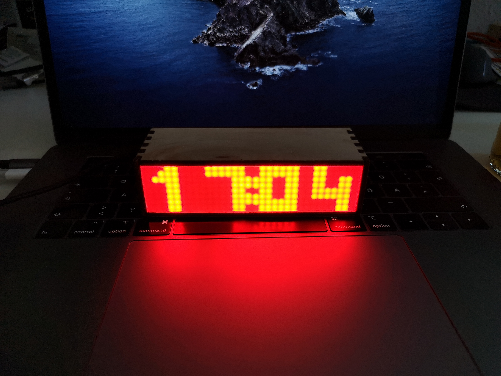
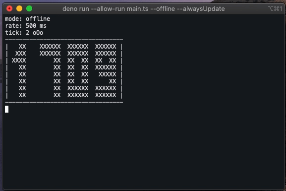
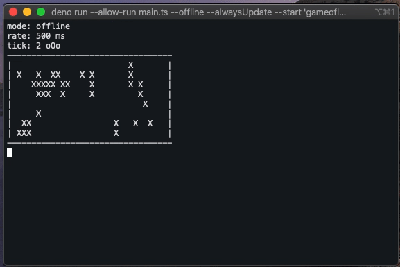

# Smartrix
Turn your MAX7219 matrix into a smart display with the power of micropython and deno.





# Features
- Plugin support! Extend the features of your smartrix by writing your own plugins.
- An emulator in your terminal, so you don't need the hardware to run this project.

# Current plugins
- clock
- game of life
- cpu monitor

# Prerequisites
- VSCode (optional but recommended)
- [esptool](https://github.com/espressif/esptool)
- The micropython binaries for your esp32. You can download these here: https://micropython.org/download/
- [Deno](https://github.com/denoland/deno)

# Getting started
> In the next part ````<PORT>```` is referenced. This is your serial port, where your esp32 is connected to your computer. This information varies across the operating systems, but there are a lot tutorials out there which help you to find out, how your serial port is named.
1. Download or clone this repository.
2. Download the micropython firmware for your board and place this right beneath this readme file.
3. Erase the flash on your esp32 with ````esptool.py --port <PORT> erase_flash````
4. Now flash the firmware with ````esptool.py --chip esp32 --port <PORT> write_flash -z 0x1000 esp32.bin```` assuming you are in the directory, where you downloaded the firmware from step 2. In this example it is named esp32.bin.
5. Edit the src/boot.py file and enter the SSID (The name of your wifi) and PASS (The password of your wifi).
6. Copy the code to your esp32 with ````rshell -p <PORT> rsync -m src/. /pyboard/```` assuming your current directory is the root dir of this repository.
7. Open up a console and navigate to the path where you extracted this repository
8. run ````deno run --allow-net --allow-run deno/main.ts --host <host>```` where ````host```` is the ip of your esp32 board in your network.
9. You should see someting on your LED matrix!

# Optional configuration
In addition to ````deno run --allow-net --allow-run deno/main.ts```` you can tweak some settings:

flag           | default value | description
---------------|---------------|-------------
--host         | none          | if set, smartrix runs in online mode. Specify the ip address of your esp32.
--port         | 8080          | specifies the tcp port of the esp32.
--rate         | 500           | sets the refresh rate in ms.
--alwaysUpdate | false         | by default, the screen is only updated, if the content to display has changed. If you want to update every tick, set this to true.
--brightness   | 15            | sets the brightness of you matrix module. Range is between 0-15. Has no effect when run in offline mode.
--rotation     | 6             | defines how long one plugin is displayed in ticks. The duration of one tick is defined with the --rate option. If you set a rate of 500 and a rotation of 6, every 3 seconds the plugins rotate.
